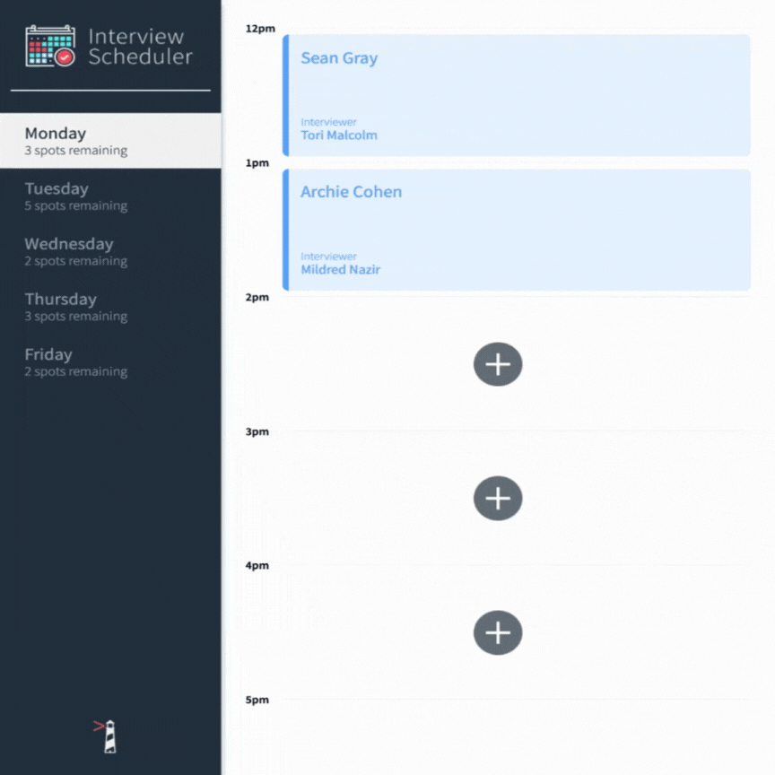

# Interview Scheduler

Interview Scheduler is a single-page application that allows users to book and manage appointments. It provides a user-friendly interface for scheduling interviews between students and interviewers.

## Built With

- React
- Axios
- PostgreSQL
- Express
- Node.js
- Storybook
- Cypress
- Jest

## Features

- View appointments for each day of the week
- Book an appointment by selecting an available time slot and providing student name
- Edit an existing appointment by changing the student name or interviewer
- Delete an existing appointment
- Display real-time updates for appointment availability
- Error handling for failed network requests

## Preview



## Setup

1. Clone the repository from GitHub
2. Install dependencies by running `npm install` in the project directory.

## Running The Application

```sh
npm start
```

The application will be available at http://localhost:8000 in your web browser.

We will also need another repository to run the backend server which can be found here:
https://github.com/lighthouse-labs/scheduler-api

## Running Tests

The project includes both unit and integration tests using the Jest test framework. To run the tests, use the following command:

```sh
npm test
```

This will execute all the test suites and display the results in the terminal.

## Running Storybook

The project uses Storybook to build and showcase components in isolation. To run Storybook and explore the components, use the following command:

```sh
npm run storybook
```

This will start Storybook and open it in your browser at http://localhost:9000.

## Running Cypress End-to-End Tests

- Prepare the database by duplicating the `.env.development` file and name the new copy `.env.test` inside the [scheduler_api repo](https://github.com/lighthouse-labs/scheduler-api). In that new file, change only the `PGDATABASE` value to `scheduler_test`.

```sh
REACT_APP_WEBSOCKET_URL=ws://localhost:8001
PORT=8000
CHOKIDAR_USEPOLLING=false

PGHOST=localhost
PGUSER=development
PGDATABASE=scheduler_test # this line
PGPASSWORD=development
PGPORT=5432

```

- Create a new database called `scheduler_test`. We will run psql to perform this operation.

```
psql -U development
CREATE NEW DATABASE scheduler_test;
```

- Run the [scheduler_api](https://github.com/lighthouse-labs/scheduler-api) server on the Host machine with `NODE_ENV=test npm start` and reset the test database by making a GET request to http://localhost:8001/api/debug/reset.
- If configured properly, we can now run `psql -U development -d scheduler_test` and test that the seed data is correct by running this command `SELECT * FROM days JOIN appointments ON appointments.day_id = days.id LEFT JOIN interviews ON interviews.appointment_id = appointments.id ORDER BY appointments.id;`

```
 id |  name   | id | time | day_id | id |   student    | interviewer_id | appointment_id
----+---------+----+------+--------+----+--------------+----------------+----------------
  1 | Monday  |  1 | 12pm |      1 |  1 | Archie Cohen |              1 |              1
  1 | Monday  |  2 | 1pm  |      1 |    |              |                |
  2 | Tuesday |  3 | 12pm |      2 |    |              |                |
  2 | Tuesday |  4 | 1pm  |      2 |    |              |                |
(4 rows)

scheduler_test=#
```

- Run cypress: `npm run cypress` and select one of the following test files to run:

```
cypress/integration/bavigation.spec.js
cypress/integration/appointments.spec.js
```
